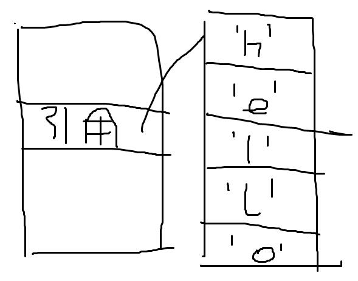

ES有5种原始值(primitive value)，他们代表着ES能直接访问的数据。
5种原始值对应着5种原始类型。

* Undefined类型。只有一个值，就是undefined。
* Ｎull类型。只有一个值，就是null。
* Boolean类型。有两个值，true和false。
* String类型。值被认为是有限长度的字符序列。
* Number类型。值就是数值。

# 关于typeof关键字

一般情况下，使用typeof可以判断一个值的原始类型。

~~~
typeof true;//"boolean"
typeof 'ES';//"string"
typeof 0;//"number"
~~~

笔者建议用===undefined（null）来判断一个变量是否为Undefined（Null）类型。
理由如下：

* Undefined和Null类型只有一个值，使用===比较直观。
* 由于某些历史原因，typeof null将会得到"object"。

当typeof 作用于对象时：

~~~
typeof {};//"object"
~~~

对象不能被直接访问，所以不算是原始值，但typeof对象返回了"object"。
对象的引用本质上也是值，如果把typeof的作用视为识别值的类型，无论其是否为原始值，那么typeof对象返回“object”就是合理的行为了。

typeof任何类型（class）的对象都会返回"object"。
可是Function类型除外。

~~~
typeof new Function();//"function"
~~~

对于这种矛盾的现象，我们可以简单地归结于typeof的设计缺陷。
另一方面，我们可以认为typeof并不纯粹是用于识别值的类型。

## 关于String类型

为了保障程序的运作效率，String类型的值在ES内部实现中是一个引用值，ES通过这个引用值间接地访问具体的字符序列。

为什么不直接把String类型设计成引用类型呢？
因为字符串被实现为一段连续的值，中途不需要通过引用去间接访问后续的字符序列，这样就可以保障字符串的访问效率。

如果作为引用类型设计，那么当ES访问字符串中的每个字符时都需要判断他是值类型还是引用类型，极其地浪费运算资源。
在程序内部将字符串视为一段连续的值时，就可以默认他的每一项都是值，不进行间接访问的判断了。

 综上所述，String类型仍然属于值类型。

