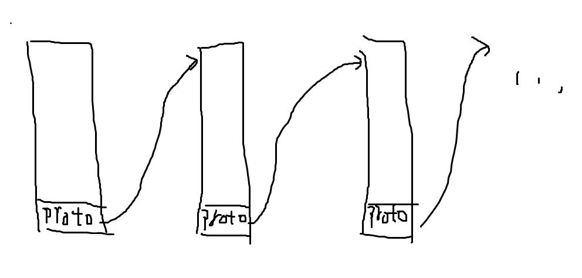
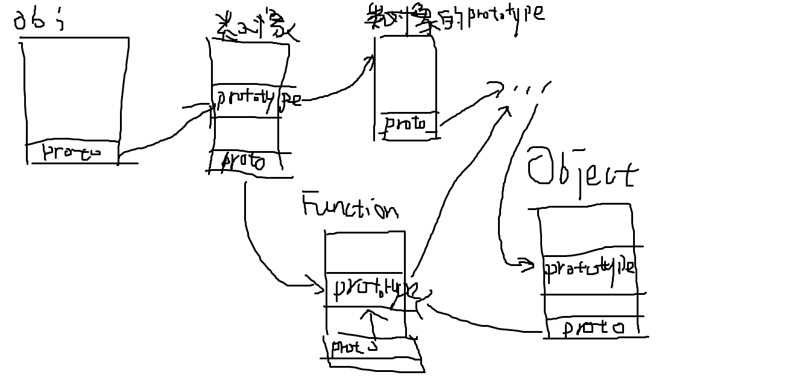

# proto

ES中的对象都保留着原型的引用。
当对象访问一个自身没有的属性时，会试图从原型中访问该属性。
而原型也是一个对象。如果在原型中仍然没找到该属性，将试图从原型的原型中访问……

因为其链表的结构，所以被称为原型链。

chrome浏览器环境中的原型是在对象属性上显式的实现，以下的例子有通过对__proto__属性访问改变对象的原型。
但这在真正的编程环境中是不被推荐的，因为不是所有的浏览器都有__proto__的实现。

~~~
var foo = {};
var prototype = {
    name: 'I in prototype.'
};
foo.__proto__ = prototype;
console.dir(foo.name);//I in prototype.
~~~

# Function

对一个Function类对象使用**new**关键字，可以构造一个指定原型的对象。
而这种方式所指定的原型，是该Function类对象的**prototype**属性。

~~~
var classA = function () { };
classA.prototype = { name: 'I in prototype.' };

var foo = new classA();
console.dir(foo.name);//I in prototype.
~~~

这种使用一个函数对象A构造出另一个对象B的行为，被称为类的实例化。
A为B的类，B为A的实例。

使用**instanceof**关键字可以判断一个对象是否为一个函数对象的实例。

~~~
foo instanceof classA;//true
~~~

实际上instanceof判断的是，一个对象的原型链中其中一个原型是否为另一个函数对象的prototype。

~~~
var mock = function () { };
mock.prototype = classA.prototype;

foo instanceof mock;//true
~~~

该实例确实能通过原型链使用该类提供的属性，所以instanceof的语义并没有发生变化，A instanceof B仍然是判断A是否为B的实例。

值得一提的是Function对象由其本身构造。

~~~
Function.prototype === Function.__proto__;//true;不恰当的例子。
~~~

# Object

Function对象的prototype属性也是一个对象，该prototype是由Object对象构造的。

~~~
Function.prototype.__proto__ === Object.prototype;//true;不恰当的例子
~~~

ES的对象都是由函数对象构造的，因此任何对象都是Object的实例。

~~~
Function instanceof Object;//true
Number instanceof Object;//true
new Number() instanceof Object;//true
//..
~~~

那么Object是由谁构造的?
Object也是一个函数对象，所以他由Function对象构造的。

~~~
Object.__proto__ === Function.prototype;//true;不恰当的例子
~~~

对象的构造关系：

对象的原型链关系：

# How和What

在这很有必要重申How和What的问题。

上面的两张关系图，记下来一点用处都没！！！

只要掌握原型链的本质(What)，这些兜兜转转的图自然能画出来(How)。

> ES中的对象都保留着原型的引用。
当对象访问一个自身没有的属性时，会试图从原型中访问该属性。
而原型也是一个对象。如果在原型中仍然没找到该属性，将试图从原型的原型中访问……

# 构造函数

用来构造对象的函数对象，他的函数本身被称为构造函数。

构造函数可以接受参数，在执行时能通过this关键字对构造出来的对象进行操作。

~~~
var classA = function (name) {
    this.name = name;
};

var foo = new classA('foo');
console.dir(foo);
~~~

new classA的执行步骤可以看做是:

1. 新构造一个对象。
2. 将对象的原型指向classA的prototype。
3. 使对象调用classA这个构造函数。

