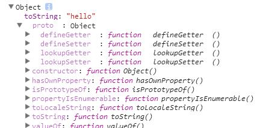

对象的属性可以通过两种方式进行访问:

* obj.key1。key1为标识符。
* obj\[key2\]。key2为任意值。

~~~
var obj = {};
obj.foo = 10;
obj['foo'] = 20;
console.log(obj.foo);//20
~~~

使用obj.key语法去访问一个属性时，key部分会有跟变量名一样的命名限制。
使用obj\[key\]则没有，甚至能通过变量传入键名。如:

~~~
var obj = {};
obj.*foo=10;//报错
var key = '***';
obj[key] = 666;//obj['***']为666
~~~

理论上，对象访问不同键名的属性都一样快，也不会因为属性数量的增长而变慢。详情自寻哈希表。

# \_\_proto\_\_

当访问对象一个不存在的属性时，会试图从他的\_\_proto\_\_属性引用的原型中访问该属性。
而一个原型对象也有他的\_\_proto\_\_属性，所以会一直往下寻找。
直到找到那个属性或原型不存在(null)时，返回undefined。

~~~
var foo={};//foo没有设定任何属性。
foo.toString()//从原型中访问。
console.log(foo.foo);//undefined。
~~~

如果给对象不存在的属性进行赋值，就会为该对象生成新的属性，但不会进入该对象的原型进行寻找或访问。

~~~
var foo = {};
foo.toString = "hello";
console.dir(foo);
~~~

这就是所谓的原型链。关于如何生成原型链，将会在后文进行讲解。

# 如何解释这种行为

当对象只是值的组合时，对象的概念还很简单，但加入原型链后却变得复杂。

实际上，我们可以把访问对象的行为当作是用函数操作对象，只不过是ES简化了语法。

~~~
var foo = {};
foo.a = 0;//__newindex(foo,'a',0);
foo['a'] = 10;//__newindex(foo,'a',10);
console.log(foo.a);//10;__index(foo, 'a');
foo.toString();//(__index(foo, 'toString'))();
~~~

其中，不触发原型链的两个特别函数。

~~~
var __index = function (obj, key) {
    //对象存在属性时返回
    if (obj[key]) {
        return obj[key];
    }
    else {
        if (obj.__proto__) {
            //从原型中寻找
            return __index(obj.__proto__, key);
        }
        else {
            return undefined;
        }
    }
}

var __newindex = function (obj, key, value) {
    //直接设置属性的值
    obj[key] = value
};
~~~

PS：lua和js非常近似，以上两个函数名都来自于lua的元表。

